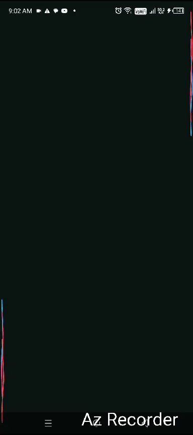

## Wave Animation Explanation

The `waveAnimation` function in this project creates a dynamic and visually appealing wave effect using Jetpack Compose. Here’s a detailed breakdown of how it works:

### Key Components

#### Infinite Transition

The `rememberInfiniteTransition` function is used to create animations that repeat indefinitely. This is ideal for animations like waves that continuously move and change.

#### Animated Properties

Several properties of the wave are animated over time:

- **`translateY`**: Controls the vertical movement of the wave.
- **`frequency`**: Adjusts how frequently the wave peaks and troughs occur.
- **`length`**: Defines the horizontal extent of the wave.
- **`amplitude`**: Determines the height of the wave peaks.
- **`animatedColor`**: Transitions between the initial and target colors of the wave.

### Animation Mechanics

#### Vertical Movement (`translateY`)

The wave's vertical position is animated using the `translateY` property. This makes the wave appear to move up and down continuously.

#### Frequency, Amplitude, Length, and Color

These properties are animated using `infiniteRepeatable` with different settings:

- **`frequency`** and **`amplitude`** are animated to oscillate between a minimum and maximum value.
- **`length`** adjusts the horizontal spread of the wave.
- **`animatedColor`** smoothly transitions between the `initialColor` and `targetColor`.

